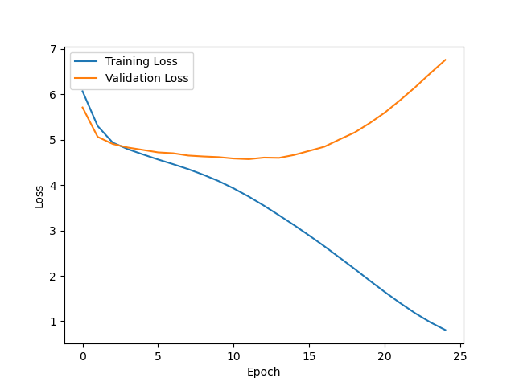
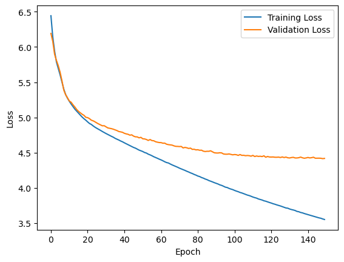

# Small Language Model

This is just a small language model that I made for fun. It's not very good but it's a good way to learn about GPT like transformer models actually work.

NOTE: Training is not well optimized and the dataset is rather small so there is a lot of room for improvement.

**Before using standard methods**

**After making some _trivial_ changes**
- Added RMSNorm
- Added Gradient Clipping
- 1/10th the learning rate

Training loss over time

**NOTE**
Differences in this model and GPT3 were taken from LLaMa and PaLM

## References
- [Attention is All You Need](https://arxiv.org/pdf/1706.03762.pdf)
- [Language Models are Few-Shot Learners](https://arxiv.org/pdf/2005.14165v4.pdf)
- [Language Models are Unsupervised Multitask Learners](https://cdn.openai.com/better-language-models/language_models_are_unsupervised_multitask_learners.pdf)
- [Mamba](https://arxiv.org/ftp/arxiv/papers/2312/2312.00752.pdf)
- [RMSNorm](https://arxiv.org/pdf/1910.07467.pdf)